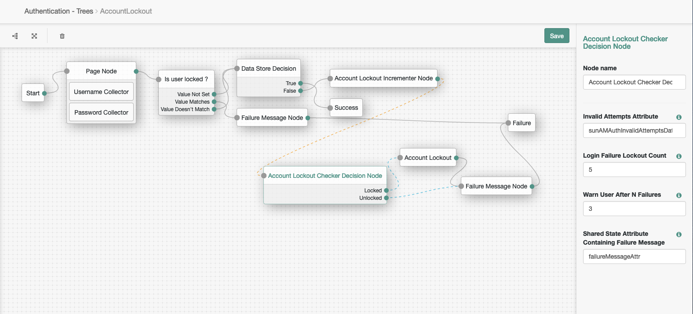

<!--
 * The contents of this file are subject to the terms of the Common Development and
 * Distribution License (the License). You may not use this file except in compliance with the
 * License.
 *
 * You can obtain a copy of the License at legal/CDDLv1.0.txt. See the License for the
 * specific language governing permission and limitations under the License.
 *
 * When distributing Covered Software, include this CDDL Header Notice in each file and include
 * the License file at legal/CDDLv1.0.txt. If applicable, add the following below the CDDL
 * Header, with the fields enclosed by brackets [] replaced by your own identifying
 * information: "Portions copyright [year] [name of copyright owner]".
 *
 * Copyright 2020 ForgeRock AS.
-->
# AccountLockout-IncrementerChecker

An Account Lockout incrementer and checker nodes for ForgeRock's [Identity Platform][forgerock_platform] 6.5 and above. 
These nodes persists failed authentication attempts in JSON format, provides failure messages(warning and account lockout failures) as shared state and checks if account is locked or not. 

**NODE DETAILS**
* **AccountLockoutIncrementerNode**: A node which persists failed authentication attempts in user's profile in JSON format `{"invalidCount":2,"lastInvalidAt":1579382470795}`. Also provides failure duration window for failed authentications. 
* **AccountLockoutCheckerDecisionNode**:  This node returns unlocked or locked based on invalid attempts. Also updates shared message state with appropriate failure message such as warning and account lockout failures messages. 

Copy the .jar file from the ../target directory into the ../web-container/webapps/openam/WEB-INF/lib directory where AM is deployed.  Restart the web container to pick up the new node.  The nodes will then appear in the authentication trees components palette.

##USAGE

The code in this repository has binary dependencies that live in the ForgeRock maven repository. Maven can be configured to authenticate to this repository by following the following [ForgeRock Knowledge Base Article](https://backstage.forgerock.com/knowledge/kb/article/a74096897).

**Account Lockout tree**




**User Profile updates**


**TESTING**
1. First authentication.
```
   curl --location --request POST 'http://am651.example.com:8086/am/json/realms/root/realms/employees/authenticate?authIndexType=service&authIndexValue=AccountLockout' \
    --header 'Content-Type: application/json' \
    --header 'Accept-API-Version: resource=2.0, protocol=1.0' \
    --data-raw '{
        "authId": "eyJ0eXAiOiJKV1QiLCJhbGciOiJIUzI1NiJ9....",
         "callbacks": [
            {
                "type": "NameCallback",
                "output": [
                    {
                        "name": "prompt",
                        "value": "User Name"
                    }
                ],
                "input": [
                    {
                        "name": "IDToken1",
                        "value": "user.99"
                    }
                ],
                "_id": 0
            },
            {
                "type": "PasswordCallback",
                "output": [
                    {
                        "name": "prompt",
                        "value": "Password"
                    }
                ],
                "input": [
                    {
                        "name": "IDToken2",
                        "value": "invalidPassword123131"
                    }
                ],
                "_id": 1
            }
        ]
    }'

    {"code":401,"reason":"Unauthorized","message":"Login failure"}
```

2. Authentication failure when warning counter is reached 
```
   curl --location --request POST 'http://am651.example.com:8086/am/json/realms/root/realms/employees/authenticate?authIndexType=service&authIndexValue=AccountLockout' \
    --header 'Content-Type: application/json' \
    --header 'Accept-API-Version: resource=2.0, protocol=1.0' \
    --data-raw '{
        "authId": "eyJ0eXAiOiJKV1QiLCJhbGciOiJIUzI1NiJ9....",
         "callbacks": [
            ...
        ]
    }'

    {
        "code": 401,
        "reason": "Unauthorized",
        "message": "Login failure",
        "detail": {
            "failureUrl": "Authentication Failed Warning: You will be locked out after 2 more failure(s)."
        }
    }
```

3. Authentication failure when account is locked
```
   curl --location --request POST 'http://am651.example.com:8086/am/json/realms/root/realms/employees/authenticate?authIndexType=service&authIndexValue=AccountLockout' \
    --header 'Content-Type: application/json' \
    --header 'Accept-API-Version: resource=2.0, protocol=1.0' \
    --data-raw '{
        "authId": "eyJ0eXAiOiJKV1QiLCJhbGciOiJIUzI1NiJ9....",
         "callbacks": [
            ...
        ]
    }'

    {
        "code": 401,
        "reason": "Unauthorized",
        "message": "Login failure",
        "detail": {
            "failureUrl": "Your Account has been locked."
        }
    }
```


The sample code described herein is provided on an "as is" basis, without warranty of any kind, to the fullest extent permitted by law. ForgeRock does not warrant or guarantee the individual success developers may have in implementing the sample code on their development platforms or in production configurations.

ForgeRock does not warrant, guarantee or make any representations regarding the use, results of use, accuracy, timeliness or completeness of any data or information relating to the sample code. ForgeRock disclaims all warranties, expressed or implied, and in particular, disclaims all warranties of merchantability, and warranties related to the code, or any service or software related thereto.

ForgeRock shall not be liable for any direct, indirect or consequential damages or costs of any type arising out of any action taken by you or others related to the sample code.

[forgerock_platform]: https://www.forgerock.com/platform/  
